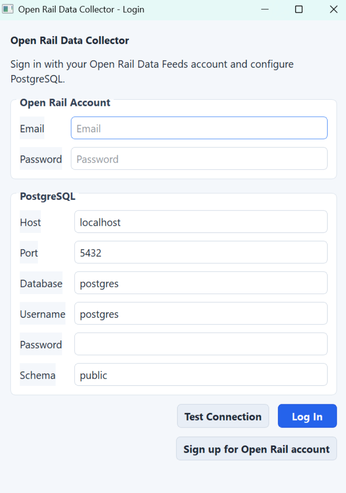
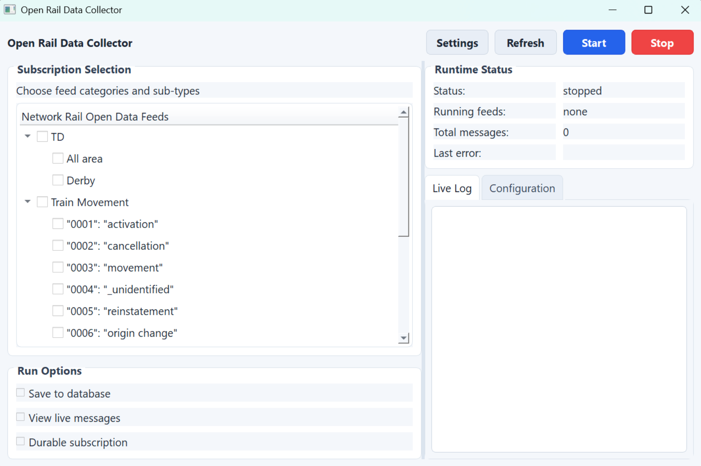

# Open Rail Data Collector

A Python application for collecting **Network Rail Open Data Feeds** and storing them into **PostgreSQL**.

The project provides two ways to run the system:

1. **GUI Application (PyQt5)** – interactive configuration and monitoring
2. **Docker Service** – headless background data collection using Docker / Docker Compose

Supported feeds:

- **TD (Train Describer)**
- **Train Movement**
- **VSTP**
- **RTPPM**

Incoming messages are decoded and optionally stored in PostgreSQL.
------

<p align="center">
  
  
</p>

# GUI Interface

## Login and Database Configuration


The login window allows you to configure:

- Open Rail Data account
- PostgreSQL connection settings

Fields:

- Email
- Password
- Database host
- Port
- Database name
- Username
- Password
- Schema

You can test the database connection before logging in.

------

## Feed Selection and Runtime Monitor


The main interface allows you to:

### Select Feeds

Available feeds include:

- TD
- Train Movement
- VSTP
- RTPPM

Each feed contains selectable message types.

### Runtime Options

- **Save to database**
- **View live messages**
- **Durable subscription**

### Runtime Monitoring

The right panel displays:

- Service status
- Running feeds
- Total messages
- Errors
- Live logs

------

# Running the GUI Version

## Install dependencies

```
pip install -r requirements.txt
```

## Start the application

```
python main.py
```

------

# Running with Docker

The Docker version runs the **headless service** using `run.py`.

Configuration is provided through **setting.json**.

------

# Install Docker

Download Docker Desktop:

https://www.docker.com/products/docker-desktop/

Verify installation:

```
docker --version
```

------

# Using Docker Compose (Recommended)

Create a file named:

```
docker-compose.yml
```

Example configuration:

```
version: "3.9"

services:

  openrail:

    build: .

    container_name: openrail-collector

    restart: unless-stopped

    volumes:
      - ./setting.json:/app/setting.json
      - ./sop:/app/sop
      - ./logs:/app/logs

    environment:
      - TZ=UTC
```

------

# Start the Service

```
docker compose up -d
```

This will:

1. Build the image
2. Start the collector container
3. Mount configuration files

------

# Stop the Service

```
docker compose down
```

------

# View Logs

```
docker compose logs -f
```

------

# Configuration

The service reads configuration from:

```
setting.json
```

Example:

```
{
  "open_rail": {
    "email": "your_email",
    "password": "your_password"
  },

  "database": {
    "sql_host": "host.docker.internal",
    "port": 5432,
    "database_name": "postgres",
    "sql_username": "postgres",
    "sql_password": "password",
    "schema_name": "public"
  },

  "subscriptions": {

    "TD": {
      "enabled": true,
      "areas": ["All area"]
    },

    "Train Movement": {
      "enabled": true,
      "types": [
        "\"0001\": \"activation\"",
        "\"0002\": \"cancellation\"",
        "\"0003\": \"movement\""
      ]
    },

    "VSTP": {
      "enabled": true
    },

    "RTPPM": {
      "enabled": true,
      "pages": [
        "NationalPage_Sector",
        "NationalPage_Operator"
      ]
    }
  },

  "sop_files": {
    "Derby": "/app/sop/TRT1.DY2_2.SOP"
  }
}
```

------

# SOP Files

If you use Derby TD processing, place SOP files inside:

```
sop/
```

Example:

```
sop/
 └ TRT1.DY2_2.SOP
```

The path in `setting.json` must use the **container path**:

```
/app/sop/TRT1.DY2_2.SOP
```

Not Windows paths like:

```
F:\PhD\TRT1.DY2_2.SOP
```

------

# Logs

Logs are written to:

```
logs/
```

This directory is mounted from the container so logs persist between restarts.

------

# Project Structure

```
OpenRailData2026_docker
│
├─ logs/
├─ sop/
│
├─ SOP_con/
├─ ui/
│
├─ Listener.py
├─ Message_to_sql.py
├─ get_data.py
├─ MSG.py
│
├─ main.py
├─ run.py
│
├─ setting.json
├─ requirements.txt
│
├─ Dockerfile
└─ docker-compose.yml
```

------

# Typical Usage

### Development

Use the **GUI version**.

### Production

Use the **Docker Compose service**.

------

# License

Research / internal use.
